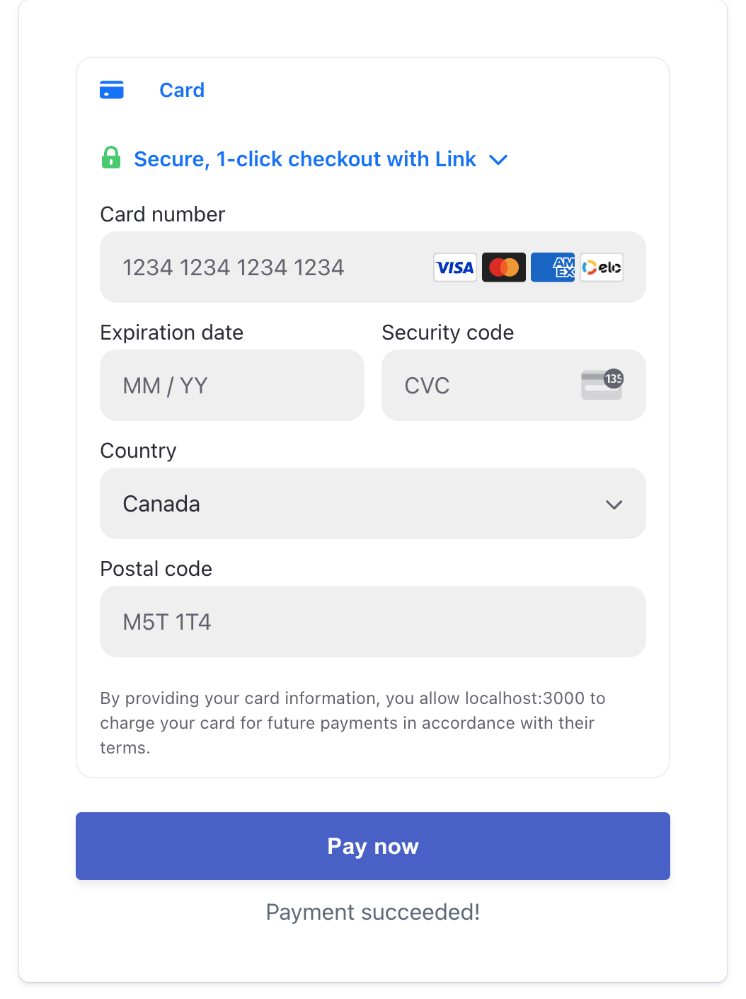

# Stripe Tutorial



## Introduction

This project follows the tutorial from the official Stripe documentation.

- [Stripe - Custom payment flow](https://docs.stripe.com/payments/quickstart)
- [Stripe - Accept a payment](https://docs.stripe.com/payments/accept-a-payment?platform=web&ui=elements)


<br>

While there are many ways to integrate Stripe into your application, this project focuses on the custom payment flow. The custom payment flow allows you to have full control over the payment process.


## Tech Stack

- TypeScript
- Next.js
- Node.js

## Getting Started

Here are the steps to get started with the project on your local machine.

### Client Side

```bash
cd client
npm ci
npm run dev
```

### Server Side

```bash
cd server
npm ci
npm run dev
```

## Testing

To test the Stripe integration, follow the instructions in the official Stripe documentation.

[Stripe - Test your integration](https://docs.stripe.com/payments/accept-a-payment?platform=web&ui=elements#web-test-the-integration)
